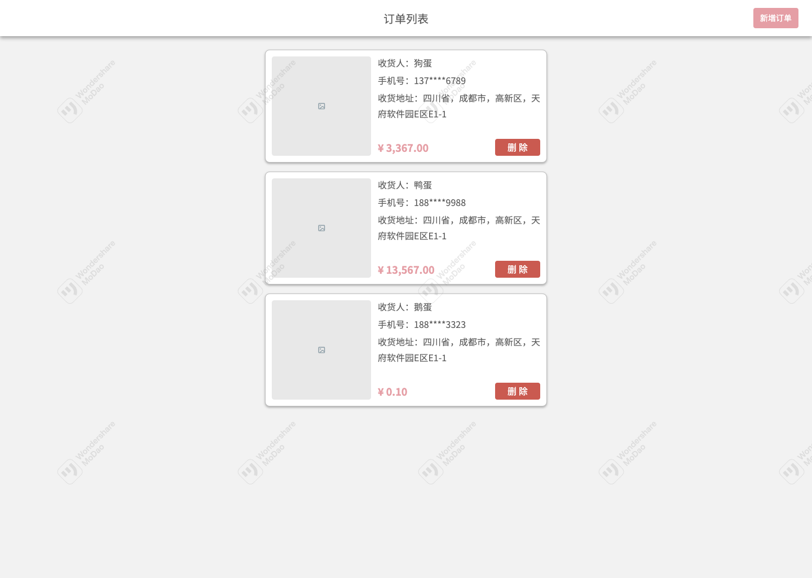
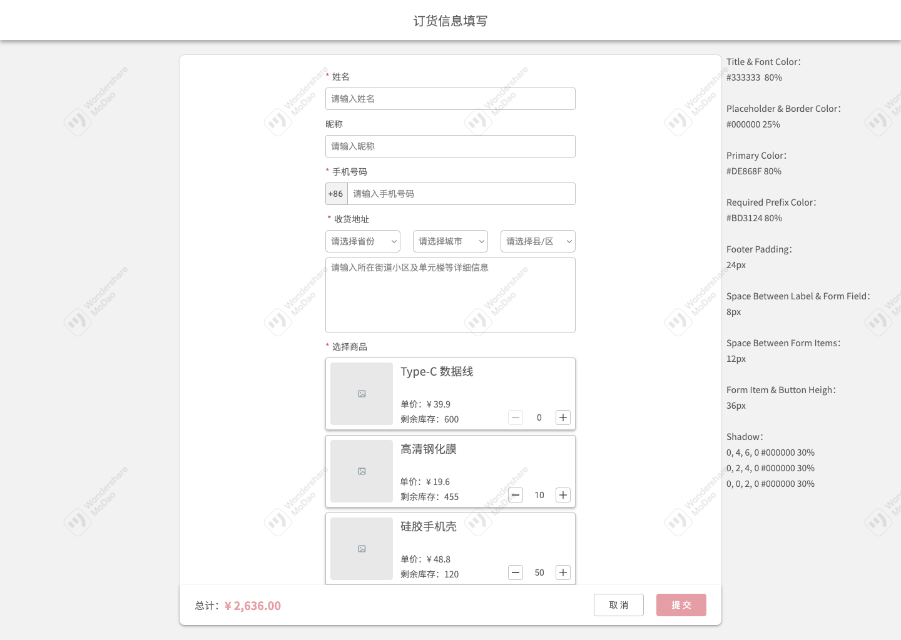

# Frontend Programming Quiz

## 技术栈

该项目由 `Vite` 脚手架搭建，使用 `TypeScript` 作为基础编程语言，UI框架和测试库分别使用的是 `Vue2(Composition API & Option API) & Vitest`。

> 项目中并没有引入 `UI Lib` 辅助开发，但你可以按需引入；在满足下面验收标准的前提下，你可以疯狂“炫技”，展示你最好的一面。
> 项目允许使用 `JavaScript`，直接使用即可，如果有 `lint` 报错请忽视。

## 如何启动

```bash
# 注意：Node 版本需满足 ^14.18.0 || >=16.0.0
# 请使用 yarn 安装依赖
yarn install
# 启动 mock server
yarn mock:server
# 启动项目
yarn dev
```

## 业务场景

手机配件厂商 *Nia（后统一称为该厂家）* 为了方便管理线下零散的手机配件订单，决定开发一系列简易的系统来提升订单管理的效率，同时节省线下沟通、审核的成本。

该系统一共分为C端和B端两个系统，B端是该厂家使用来管理订单、库存及物流等信息；C端是给线下手机配件店老板（后统一称为店主）使用来下单的。B端的系统（*Frontend + Backend*）已经开发完毕，C端的后端也已经 *Ready*，你需要为店主们开发一套易用的系统来帮助他们完成日常的下单。

### B端后端 API

#### 商品订单列表

```typescript
/**
 * @api /api/orders
 * @method GET
 * @returns {Array<提交订单类型>}
 */
```

#### 提交订单

```typescript
/**
 * @api /api/orders
 * @method POST
 * @header Content-Type: application/json （POST 请求添加）
 * @returns {请自己设计}
 */
```

#### 库存商品

```typescript
/**
 * @api /api/goods
 * @method GET
 * @returns {{
 *  id: string,
 *  name: string,
 *  description: string,
 *  cover: string,
 *  stock: number,
 *  price: number
 * }[]}
 */
```

## 原型图

### 首页（即订单列表页面）



### 下单



## 验收标准

### Story1

- As a 店主
- 我期望能够查看我历史订单的信息
- 以便我能更加方便地对账，和管理后续的下单计划

#### AC1

- Given：店主A已经登录
- When：店主A进入系统首页
- Then：店主A可以看到自己的历史订单信息列表（包括：收货人、手机号、收货地址、总金额及订单商品图片等信息）

> 1. 如无历史订单则展示“暂无订单”字样
> 2. 如有多个商品则展示第一个商品图片

#### AC2

- Given：店主A已经登录
- When：店主A进入系统首页
- Then：店主A可以看到自己的每个历史订单项有删除按钮，点击可以删除指定的历史订单

### Story2

- As a 店主
- 我期望能够从系统中直接下单
- 以便能实时看到最新的库存等信息，更好的规划下单商品和数量，节省我和厂家线下沟通的时间

#### AC1

- Given：店主A已经登录
- When：店主A进入系统首页
- Then：店主A可以看到首页有“新增订单”按钮，点击可以进入新增订单页面

#### AC2

- Given：店主A已经登录
- When：店主A进入新增订单页面
- Then：店主可以填写订单字段（包括姓名、昵称、手机号码、收货地址、选择商品等）

> 1. 姓名、手机号码、收货地址为必填字段
> 2. 选择的商品商品总量需大于0
> 3. 昵称为非必填字段

#### AC3

- Given：店主A已经登录并进入新增订单页面
- When：店主A修改商品A数量
- Then：
  - 当点击按钮添加的商品A数量超过库存数量时，无法继续添加
  - 当点击按钮减少的商品数量小于0时，无法继续减少
  - 当输入的数量超过商品A库存数量时，则默认使用最大库存数量
  - 当输入的数量小于0时，则默认使用0

#### AC4

- Given：店主A已经登录并进入新增订单页面
- When：店主A修改商品A数量
- Then：店主A可以在底部看到订单总金额，订单总金额遵循下方的优惠折扣
  - 单个商品，如果单个订单下单数量在21-40个，则超过20个的部分打9折
  - 单个商品，如果单个订单下单数量在51-100个，则超过50个的打8.5折
  - 单个商品，如果单个订单下单数量在100个以上，则超过100个的部分打8折

> 例：李店长单个订单下单了78个充电宝，有20个是原价，20个享受9折，28个享受8.5折

#### AC5

- Given：店主A已经登录并填写完订单信息
- When：店主A点击提交
- Then：校验必填选项

> 1. 如有一个字段未填写，则提示形如“请填写姓名”
> 2. 如有多个字段未填写，则提示“请完善订单信息”
> 3. 以 `Toast` 或 `Alert` 的形式提示皆可

#### AC6

- Given：店主A已经登录并按规范填写完订单信息
- When：店主A点击提交
- Then：系统提示“提交成功”，并返回首页，在首页可以看到店主A最新提交的订单

> 以 `Toast` 或 `Alert` 的形式提示皆可

#### AC7

- Given：店主A已经登录并进入新增订单页面
- When：店主A点击取消
- Then：系统出现二次弹窗提示“取消将不会保存所填写内容，并会返回首页”
  - 点击二次弹窗的确认按钮，系统返回首页
  - 点击二次弹窗的取消按钮，则关闭二次弹窗停留在新增订单页面
